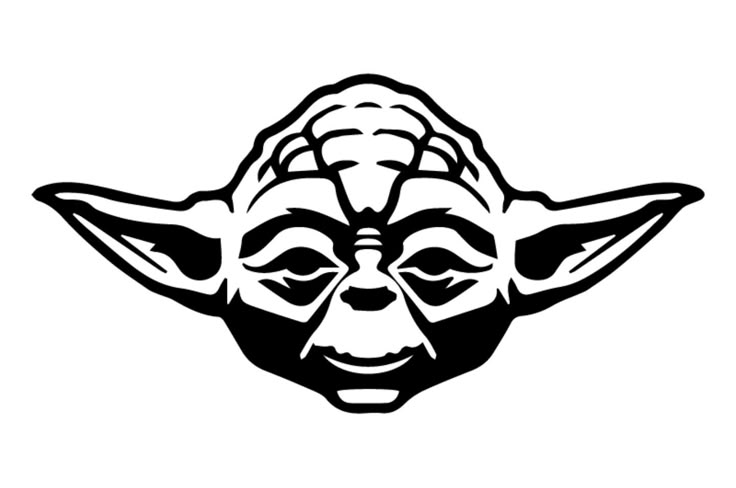
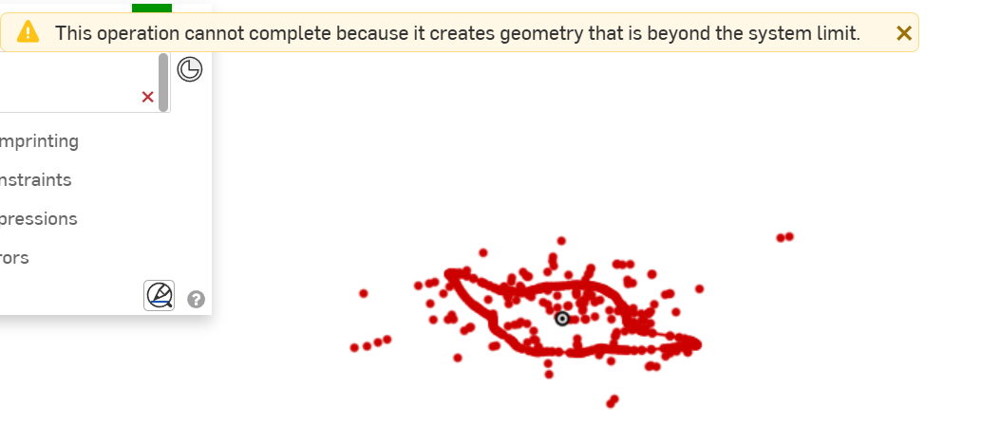
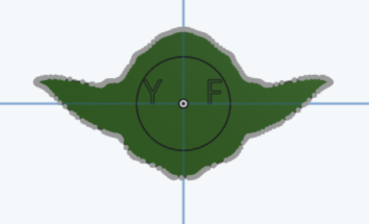

Total hours: 4.5 

# June 18th: Worked on Design
- Came up with two variations of the design:

- Decided to go with the one where it's shaped like Yoda
    - The ears may potentially come off (hopefully not) but it looks better than the one where the Yoda is enclosed in a box
- Settled on Slytherin green for the shape, silver for the words (if there is no silver filament, then I will paint)
- Found usable Yoda icon to be imported into Onshape

- Used paint to color everything black so it would just be an outline in CAD
- Converted into DXF but keep getting this error - took a while to solve it

- Succeeded using another DXF converter

**Total time spent: 1h**

# June 19th: Worked on CAD
- Created the general shape of the CAD, including the cavity

**Total time spent: 1h**

# June 20th: Worked on Letters
- Added letters on front and back
- Letters on the back keep looking misaligned - looking for ways to fix

- Realized it's probably aligned on the center of each letter, which is better than if I adjust it
- Issue - circle on the back due to cavity

    - Tried extruding the entire thing but didn't quite work
    - In the end, it worked by using "add" in the extrude instead of "new"

**Total time spent: 2h**

# June 21st: Worked on Keychain Hole
- Researched different Onshape methods to do a keychain hole
    - Sweep, Revolve, Loft, etc
- Realized doing an extrude made the most sense - got that done

**Total time spent: 0.5hr**