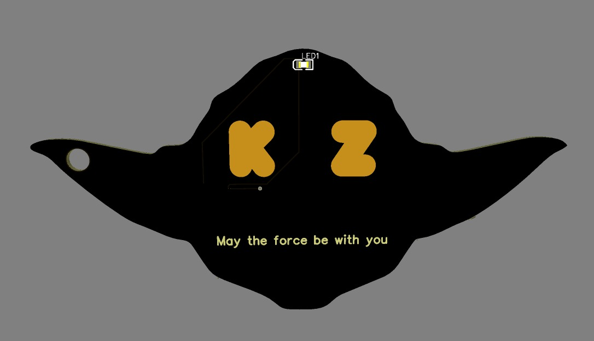
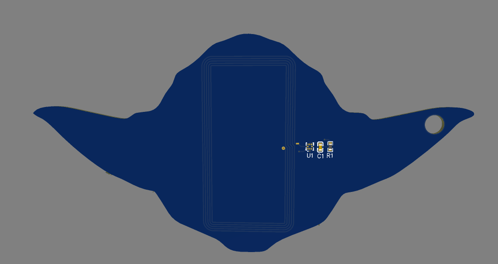

# Yoda NFC Keychain
This project is a Yoda-shaped NFC Keychain. It's in the overall shape of a Yoda, and I personalized it with my initials and "May the force be with you". The PCB has an NFC chip and antenna, enabling it to interact with devices through NFC.

## Motivation for This Project
This project was inspired by Hack Club's Asylum YSWS, where one of the challenges was to create an NFC keychain. However, during the span of that program, I was too busy to make a keychain. However, I think it's not only super cool but also very useful to be able to use a personalized keychain to interact with devices, which is why I am creating one now for Hack Club's Highway program. However, a 3d-printed keychain is too simple, so I made it a PCB.

## Final Design

* The PCB will be black, but for visual clarity purposes the back of it is in blue

## Bill of Materials
| Item | Quantity | Cost | Purpose | Link |
| ---- | -------- | ---- | ------- | ---- |
| PCB | 1x5 | 35.18 USD | | |